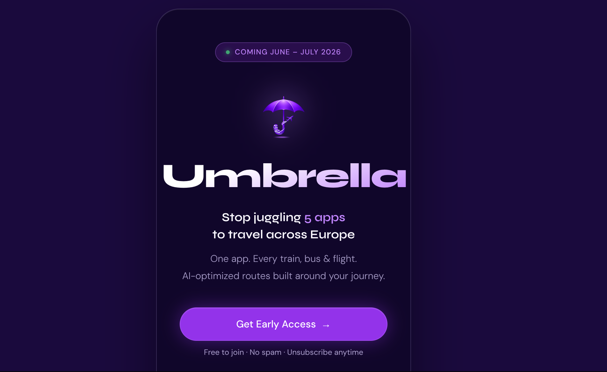

# Umbrella Landing Page

Static landing page for **Umbrella** featuring a glassmorphism card design, early-access signup CTA, and social links.

## Overview

This repository contains a single-page marketing site built with plain HTML/CSS.
It is lightweight, fast to deploy, and easy to customize.

## Preview

Add a screenshot named `preview.png` in the project root, then GitHub will render this image:



## Features

- Glassmorphism-centered card layout
- Bold brand section and launch badge
- Early-access CTA button (Google Form)
- Social/contact links (email, LinkedIn, Instagram)
- Mobile-friendly responsive design

## Tech Stack

- HTML5
- CSS3 (embedded in `index.html`)
- Google Fonts (`Syne`, `DM Sans`)

## Project Structure

- `index.html` — full page markup and styles
- `favicon_io/` — favicon assets + `site.webmanifest`

## Run Locally

### Quick open

Open `index.html` directly in your browser.

### Local server (recommended)

```bash
python3 -m http.server 8000
```

Open `http://localhost:8000`

## Customize

### 1) Background image/map

In the `body` style block in `index.html`, replace:

```css
background-color: #1a0a3d;
```

with:

```css
background-image: url('your-europe-map.jpg');
background-size: cover;
background-position: center;
```

### 2) Logo

Update the source in:

```html

```

### 3) CTA destination

Replace the main button `href` (`Get Early Access`) with your preferred signup link.

### 4) Social/contact links

Update:

- `mailto:umbrella42.project@gmail.com`
- LinkedIn URL
- Instagram URL

### 5) Launch timing

Edit badge text:

- `Coming June – July 2026`

## Deploy

Deploy as a static site on:

- GitHub Pages
- Netlify
- Vercel
- Cloudflare Pages

## Pre-publish Checklist

- Replace logo file if needed
- Set final CTA form URL
- Update all social links
- Add final background image
- Verify favicon files are present

## License

- Meh
